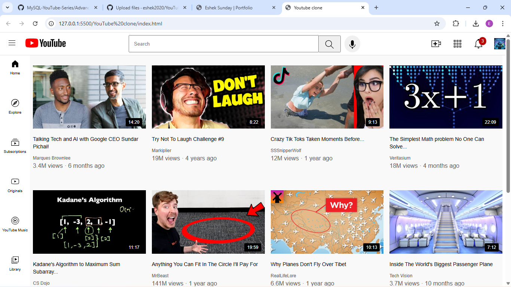

# 🎥 YouTube Homepage Clone

## 📖 Table of Contents
* [Project Overview](#-project-overview)
* [Technical Features](#-technical-features)
* [Technologies Used](#-technologies-used)
* [Data Preview](#-data-preview)
* [How to Use](#-how-to-use)

---

## 📌 Project Overview
This project is a front-end replica of the **YouTube Homepage**. It was developed to practice building complex, production-ready layouts using modern CSS. The focus was on achieving high visual fidelity while ensuring a responsive user experience across desktop and tablet devices.

---

## 🚀 Technical Features

### 1. Responsive Grid System
* Implemented **CSS Grid** for the main video feed, allowing the number of columns to dynamically adjust based on screen width (4 columns for desktop, 3 for small desktops, and 2 for tablets).
* Used **Flexbox** for the header and sidebar to handle alignment and spacing of icons and search bars.

### 2. UI/UX Elements
* **Interactive Tooltips:** Created custom tooltips that appear on hover for header icons (Search, Create, Notifications) using absolute positioning and opacity transitions.
* **Sticky Navigation:** The header is fixed to the top of the viewport, ensuring it remains accessible while scrolling.
* **Hover Effects:** Added interactive states for video thumbnails, sidebar links, and channel icons to mimic the authentic YouTube experience.

### 3. Component Architecture
* **Fixed Sidebar:** A vertical navigation bar that stays in place, providing consistent access to Home, Explore, and Subscriptions.
* **Overlay Elements:** Displayed video durations directly on top of thumbnails using relative and absolute positioning.

---

## 🛠️ Technologies Used
* **HTML5:** Semantic structure for header, sidebar, and main content areas.
* **CSS3:** Advanced styling including Grid, Flexbox, Media Queries, and Hover Transitions.

---

## 🖼️ Data Preview

### Desktop Layout View
*A snapshot of the fully responsive 4-column video grid and the navigation header.*

---

## 📂 Project Structure
* `index.html`: The core structure of the application.
* `header.css`: Styles for the navigation, search bar, and user icons.
* `side-bar.css`: Layout and styling for the vertical navigation links.
* `youtube-clone.css`: General body styles and the responsive video grid logic.

---

## 🛠️ How to Use
1. Clone the repository.
2. Open the `index.html` file in any modern web browser.
3. Resize the window to see the responsive grid in action.
